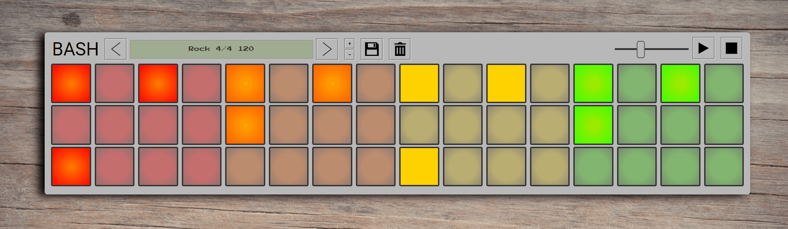

# BASH

A browser based drum sequencer, styled like an analog machine.

The user is presented with an intuitive interface that allows them to customize their grooves. Tempo and Time Signature allow the user to achieve mamy different styles and feels. Drum grooves can be named and saved/deleted for later use. The app uses the Web Audio Api for a stable performace from the audio playback.

## Deployment

[Check out the app here](https://bash-zmtv5.ondigitalocean.app)

## Technologies

* Javascript / HTML / CSS
* React
* Web Audio Api

